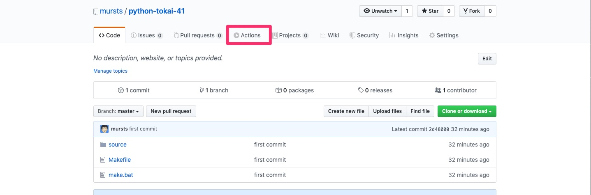
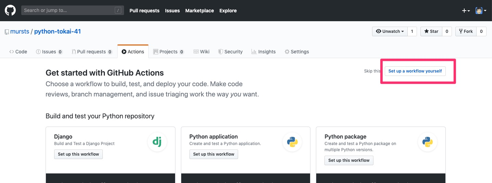
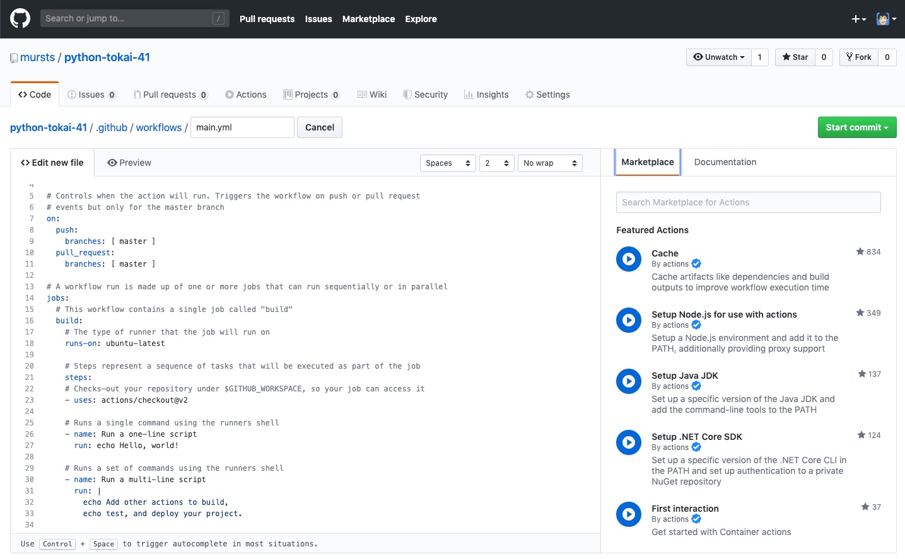

.. Python Tokai 41th documentation master file, created by
   sphinx-quickstart on Fri Mar  6 15:38:04 2020.
   You can adapt this file completely to your liking, but it should at least
   contain the root `toctree` directive.

============================================================
SphinxとGitHub Actionsを使ってプレゼンの資料を作る
============================================================

| 2020/03/07 Python東海 41th 

I am
==============================

* 三浦 智 (@mursts)

  * Python東海 管理人
  * Python Boot Camp in 愛知 現地スタッフ
  * GCPUG Nagoya オーガナイザー

-- 

.. image:: ./_images/comunity.jpg

内容
==============================

- Sphinxとは
- GitHub Actionsとは
- デモ

内容
==============================

- **Sphinxとは**
- GitHub Actionsとは
- デモ

Sphinxとは
==============================

Python製のドキュメント作成ツール

Restructuredtextやで記述して、HTML、PDF、Wordなど様々なフォーマットで出力が可能

.. hint::
   Markdownでも書くことはできる

参考
------------------------------

- https://www.sphinx-doc.org/
- http://www.sphinx-doc.org/ja/master/index.html
- https://sphinx-users.jp/
- `ドキュメントを作りたくなってしまう魔法のツールSphinx <https://www.slideshare.net/shimizukawa/sphinx-6084667>`_

Sphinxとは
==============================

Sphinxは知らなくてもSphinxで作成されたものは必ず見ているはず

- https://docs.python.org/3/
- https://requests.readthedocs.io/en/master/
- https://docs.djangoproject.com/en/3.0/

Sphinxとは
==============================

使い方は簡単

.. code-block:: sh 

   $ pip install sphinx
   $ sphinx-quickstart

これでドキュメントを書くためのフォーマットが作成される

.. code-block:: sh

   $ tree -L 1
   .
   ├── Makefile
   ├── build
   ├── docs
   ├── make.bat
   └── source
       ├── _static
       ├── _templates
       └── index.rst

Sphinxとは
==============================

選択するテンプレートによって先程のドキュメントサイトやこの資料のようなプレゼンテーションを作成できる

https://mursts.github.io/gcpug-nagoya-02/

内容
==============================

- Sphinxとは
- **GitHub Actionsとは**
- デモ

GitHub Actionsとは
==============================

GitHub上のイベントをトリガーとした(定期実行もあり)CI/CDのサービス

https://github.co.jp/features/actions

パブリックリポジトリは無料で、プライベートでも無料枠がある

GitHub Actionsの使い方
==============================

ワークフローを設定する
------------------------------

.. hint::
   画面から作成しなくても、 `.github/workflows` にファイルを作成しても可

GitHub Actionsの使い方
==============================

GitHub Actionsの使い方
==============================

GitHub Actionsの使い方
==============================

トリガー

.. code-block:: yaml

   # This is a basic workflow to help you get started with Actions

   name: CI
   
   # Controls when the action will run. Triggers the workflow on push or pull request 
   # events but only for the master branch
   on:
     push:
       branches: [ master ]
     pull_request:
       branches: [ master ]

GitHub Actionsの使い方
==============================

ジョブ

.. code-block:: yaml

   # A workflow run is made up of one or more jobs that can run sequentially or in parallel
   jobs:
     # This workflow contains a single job called "build"
     build:
       # The type of runner that the job will run on
       runs-on: ubuntu-latest
   
       # Steps represent a sequence of tasks that will be executed as part of the job
       steps:
       # Checks-out your repository under $GITHUB_WORKSPACE, so your job can access it
       - uses: actions/checkout@v2
   
       # Runs a single command using the runners shell
       - name: Run a one-line script
         run: echo Hello, world!
   
       # Runs a set of commands using the runners shell
       - name: Run a multi-line script
         run: |
           echo Add other actions to build,
           echo test, and deploy your project.

GitHub Actionsの使い方
==============================

今回作ったWorkflow

https://raw.githubusercontent.com/mursts/python-tokai-41/master/.github/workflows/main.yml

.. code-block:: yaml

   name: Publish

   on:
     push:
       branches: [ master ]
   
   jobs:
     publish:
       name: Build
       runs-on: ubuntu-latest
       steps:
       - uses: actions/checkout@v2
       - name: Set up Python
         uses: actions/setup-python@v1
         with:
           python-version: 3.8
       - name: Install dependencies
         run: |
           python -m pip install --upgrade pip
           pip install -r requirements.txt
       - name: Build sphinx
         run: make html
       - name: Deploy
         uses: peaceiris/actions-gh-pages@v3
         with:
           github_token: ${{ secrets.ACTIONS_DEPLOY_KEY }}
           publish_dir: ./build/html

GitHub Actionsの使い方
==============================

トークンを設定する
------------------------------

- GITHUB_TOKEN

  - Actionsを設定したときに自動でできるトークン
  - 今回はこれを使用した

- DEPLOY_KEY

  - 自分で鍵を作ってGitHubに登録する

- PERSONAL_TOKEN

  - settingsから作成するトークン

GitHub Actionsの使い方
==============================

準備ができたらrstファイルを編集してmasterにPush

内容
==============================

- Sphinxとは
- GitHub Actionsとは
- **デモ**

デモ
==============================
